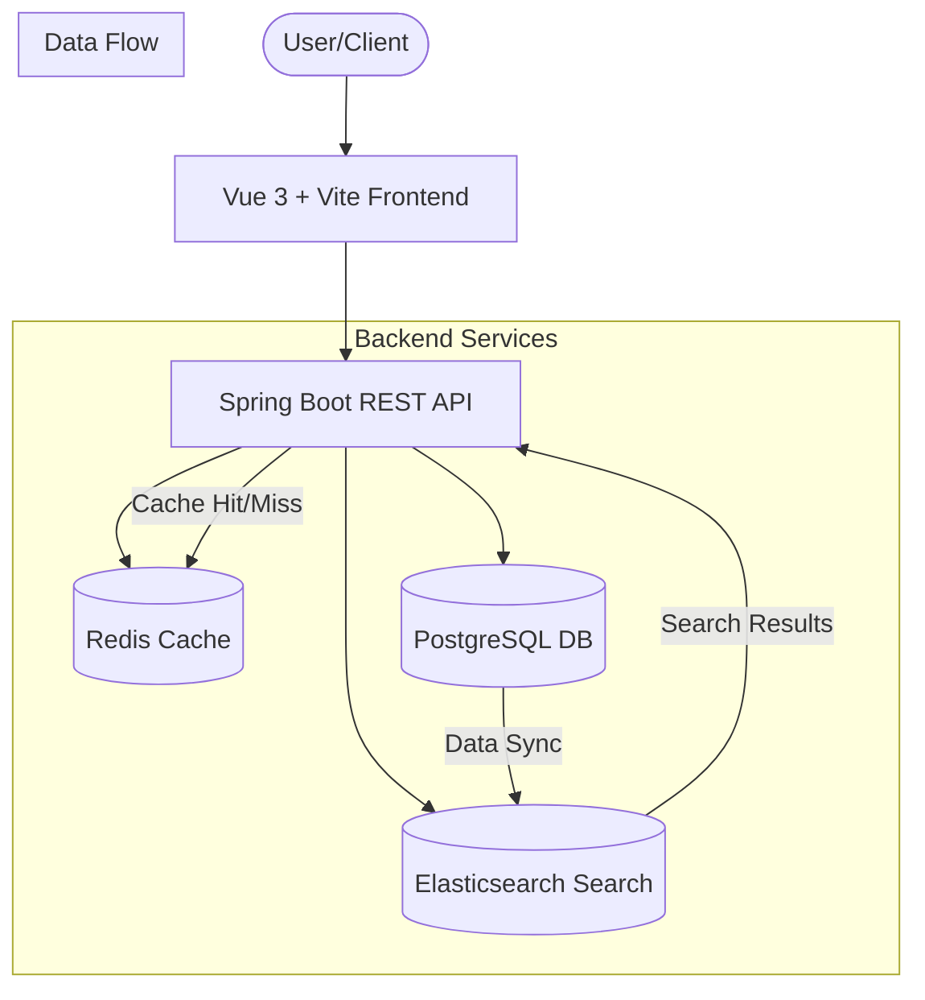

# 🚀 E-Commerce Search Engine with Ranking & Caching

A high-performance, scalable e-commerce search solution built with **Spring Boot 3.5**, **Elasticsearch 8**, **Redis**, and **PostgreSQL**. This project is designed to handle large product catalogs with sub-millisecond search latency, advanced ranking algorithms, and efficient caching strategies.

---

## 🏗️ Architecture

The system follows a modern microservices-ready architecture, leveraging best-in-class tools for search and storage.



### Key Components:
- **Spring Boot Backend**: Handles business logic, security, and orchestration between data stores.
- **Elasticsearch**: Powering the search engine with full-text search, fuzzy matching, and ranking.
- **Redis**: Caching frequently accessed search results and product details to reduce database load.
- **PostgreSQL**: Serving as the primary source of truth for product metadata and relational data.
- **Vue 3 Frontend**: A modern, responsive interface for browsing and searching products.

---

## 🛠️ Tech Stack

### Backend
- **Framework**: Java 21, Spring Boot 3.5
- **Persistence**: Spring Data JPA, Flyway (Migrations)
- **Search**: Spring Data Elasticsearch, Elasticsearch 8.13.4
- **Cache**: Spring Data Redis, Redis 7.2
- **Database**: PostgreSQL 16
- **Security**: Spring Security

### Frontend
- **Framework**: Vue 3 (Composition API)
- **Build Tool**: Vite
- **Styling**: Tailwind CSS 4
- **Language**: TypeScript

### Infrastructure
- **Containerization**: Docker, Docker Compose
- **Monitoring**: Spring Boot Actuator

---

## ✨ Features

- **Blazing Fast Search**: Full-text search across millions of products using Elasticsearch.
- **Intelligent Ranking**: Relevance-based product ranking.
- **Multi-Level Caching**: Redis integration for high-performance data retrieval.
- **Dynamic Filtering**: Robust filtering by category, brand, and price ranges.
- **Responsive UI**: Seamless shopping experience across all device sizes.
- **Dockerized Setup**: One-command deployment for the entire stack.

---

## 🚦 Getting Started

### Prerequisites
- [Docker](https://www.docker.com/get-started) & [Docker Compose](https://docs.docker.com/compose/install/)
- (Optional) JDK 21+ and Node.js 20+ for local development.

### Quick Start (Docker)

1.  **Clone the repository**:
    ```bash
    git clone https://github.com/nidhaahmed/E-Commerce-Search-Engine-With-Caching.git
    cd E-Commerce-Search-Engine-With-Caching
    ```

2.  **Start all services**:
    ```bash
    docker compose up -d
    ```

    This will spin up:
    - **Backend**: `http://localhost:8080`
    - **Frontend**: `http://localhost:3000`
    - **Elasticsearch**: `http://localhost:9200`
    - **PostgreSQL**: `localhost:5432`
    - **Redis**: `localhost:6379`

### Initializing Data
The backend includes a `DataSeeder` that automatically populates the database and indexes products to Elasticsearch on startup if specified in the profile.

---

## 🔌 API Overview

### Search Endpoints
- `GET /api/products/search?q={query}`: Perform a full-text search.
- `GET /api/products/filter?category={cat}&brand={brand}`: Filtered product listings.

### Product Management
- `POST /api/products`: Create a new product (Internal/Admin).
- `GET /api/products/{id}`: Fetch product details (cached via Redis).

---

## 📂 Project Structure

```text
├── backend/            # Spring Boot application
│   ├── src/            # Java source code
│   └── pom.xml         # Maven dependencies
├── frontend/           # Vue 3 application
│   ├── src/            # Vue components & assets
│   └── package.json    # NPM dependencies
├── docker-compose.yml  # Infrastructure orchestration
└── README.md           # Project documentation
```

---

## 📄 License

This project is licensed under the MIT License - see the [LICENSE](LICENSE) file for details.

---

**Developed with ❤️ by [Nidha Ahmed](https://github.com/nidhaahmed)**
